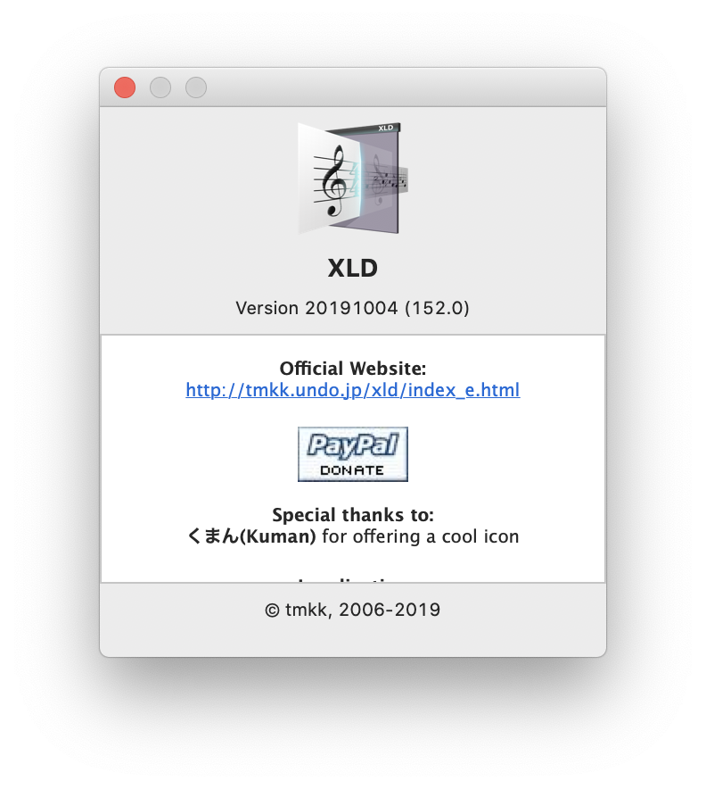

<section>

### The Problem

Logic Pro X is a music production DAW with various features, among these features is the ability to import and use your
own audio files as samples. The problem with this however, is that Logic Pro only supports a restrictive subset of audio
file types. Most of my files were .wav files, however, Logic Pro does not support bit depths <= 8 and >= 32. Thus, my
files of 8 and 32 bit depths could not be used with Logic.

</section>

<section>

### The Old Solution

<article>

In order to use my files, I turned to the XLD audio converter, which I used to convert all of my files into 24 bit depth
.wav files. This converter is widely used for this purpose and generally works well, however, running this software on
all of my files was very time costly (taking around 10 minutes), and would occasionally fail when presented with unknown
file types. Moreover, instead of only converting the files with bit depth <= 8 and >= 32 to 24 bit, it converted all of
my files to 24 bit. This not only made the size of my audio directory unnecessarily longer, it also increased the
runtime of the program significantly.

<aside>

</aside>

</article>

</section>

<section>

### The Goal

To create a fast audio converter specifically designed for Logic Pro X

</section>

<section>

### The Design

The main idea of the software was to convert only files that needed to be converted. Moreover, I wanted to add some
additional features to improve quality of life for Logic Pro X users. I personally find that my audio files are
cluttered with random non-audio files. Thus, I wanted to make a way to remove these files from my audio files and sort
them into categories. Moreover, I found that I had many duplicate audio files, thus, I took it upon myself to give the
option to remove duplicates.

</section>

<section>

### The Execution

The execution began with a python CLI I wrote to do the formatting. The first iteration preserved file structure and
formatted all 8 bit and 32 bit wav files into 24 bit using the python soundfiles library. Next, I went about identifying
and removing duplicates by hashing parts of every file and storing the hashes in a dictionary to check for duplicates.
Finally, I wrote a dumping mechanism to sort non-audio files found during the formatting process.

Next, I went about writing the frontend in HTML/JS using the Electron.js framework. Once I had laid the ground work, I
used pyinstaller to compile my python into binary and used subprocesses to spawn an instance of my CLI from within my
frontend. Using stdout monitoring I was able to display the progress of the formatting in the frontend.

</section>

<section>

### Takeaways

This project was a fun venture into more complicated desktop app development and gave me a more meaningful insight into
the Electron renderer model. Moreover, it was nice to make an application that my friends and I can enjoy and I
personally use this little project often. If you would like to, you
can [check out the github project](https://github.com/jkairoy/Audio-Alpaca)
or [download the app](https://drive.google.com/file/d/11XHHExbhgrWE0sXKIWSwJOrhXx1hjWfV/view) for yourself.

</section>
