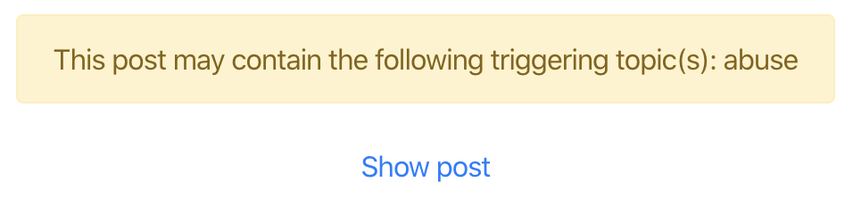
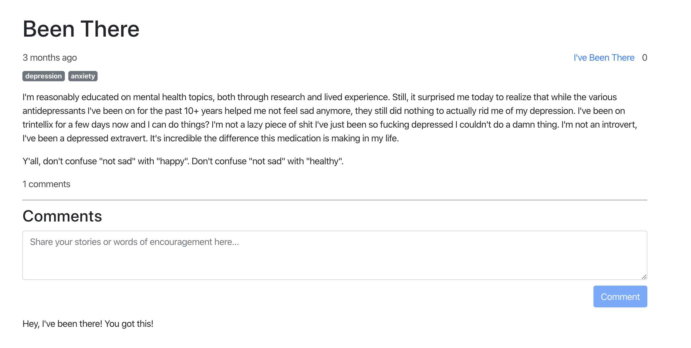

<section>

### The Goal

To help Brown organizations by giving them access to high-quality web applications developed by Brown students while
giving brown students the opportunity to improve their practical skills by developing useful applications

</section>

<section>

### The Design

<article>

We felt that the best way for messages like this to be communicated was through a message-board-esque design, where
posts could be made, found, and commented on. We wanted to avoid triggering our users at all costs, thus, we gave the
option to include possibly triggering topics, which would essentially sensor the post until a confirmation had been
given.

<aside>

</aside>

</article>

<article>

<aside>

</aside>

The most important thing to our team was to make sure that our website was a safe space where victims could not be
exploited. Thus, we chose to make communication only possible in one direction to protect users from grooming.

</article>

<article>

We believed that it was also essential to give users instant feedback and affirmation after their post had been made,
thus, if the user opted in, using our tag system, we were able to show our user an animated bubble graph of stories
similar to theirs immediately after posting.

<aside>

</aside>

</article>

</section>

<section>

### The Execution

#### FRONTEND

The frontend was made using React.js and D3 for the post visualization.

#### BACKEND

The backend was a very simple NoSQL implementation enabled by MongoDB cloud hosting with client data transfer
facilitated by Node.js

</section>

<section>

### Takeaways

This short project was a valuable exploration into the power of data visualization in UX design. Data is powerful, but
without the proper layout, it is essentially meaningless. Moreover, this was a great experience in user feedback and in
creating a product off of user narrative, as we were able to talk to several trauma victims personally, which profoundly
impacted the direction of our design. The project is hosted [here](https:~~~~//ivebeentheretoo.herokuapp.com/) if you would
like to take a look.

</section>
