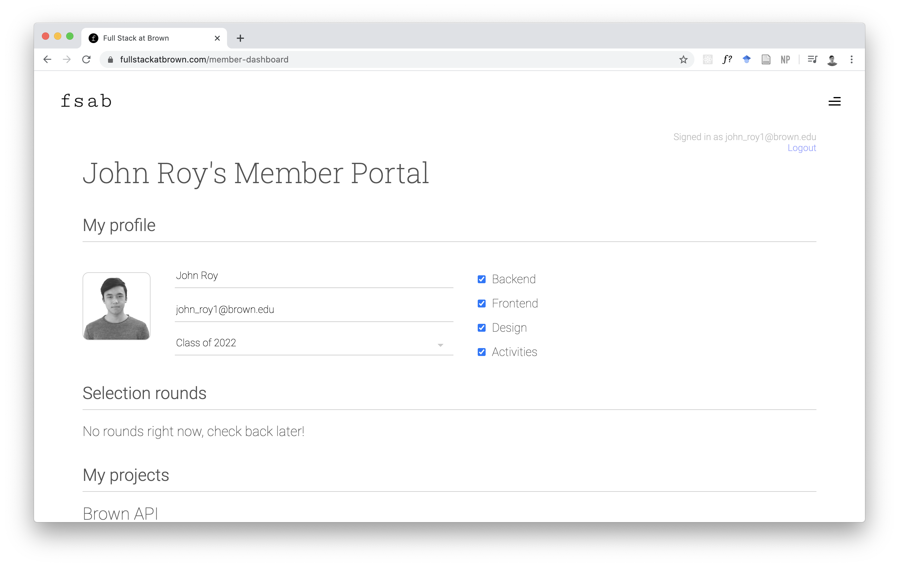
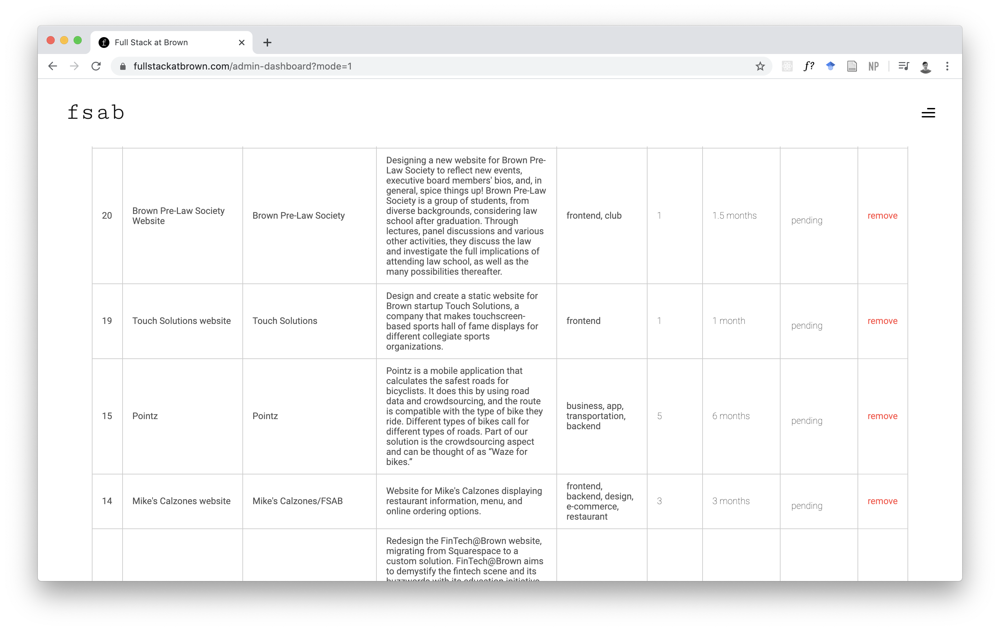

<section>

### The Goal

To help Brown organizations by giving them access to high-quality web applications developed by Brown students while
giving brown students the opportunity to improve their practical skills by developing useful applications

</section>

<section>

### What's Going On

Full Stack is now entering its second year in existance. With around 140 members, we have completed several projects and
are in the process of completing several more. We are also in the process of planning a hackathon that should take place
later this year! Check out our [website](https://fullstackatbrown.com/index.html) to see what we are up to!

</section>

<section>

### The Website

<article>

#### THE MEMBER PORTAL

Each member has access to a member portal where they are able to change their user information as well as view their
current projects and access their project selection rounds.

<aside>

</aside>

</article>

<article>

<aside>

</aside>

#### THE MEMBER PORTAL

Administrators also have access to the admin portal, where we are able to manage and process different project
proposals, tracking their statuses and adding notes where needed. The admin portal also gives users the ability to start
and manage project selection rounds, project groups, and users. Much of the information managed through the admin portal
is piped directly to the public side of the site, on the [about](https://www.fullstackatbrown.com/about) and [projects]() pages.

</article>

</section>
