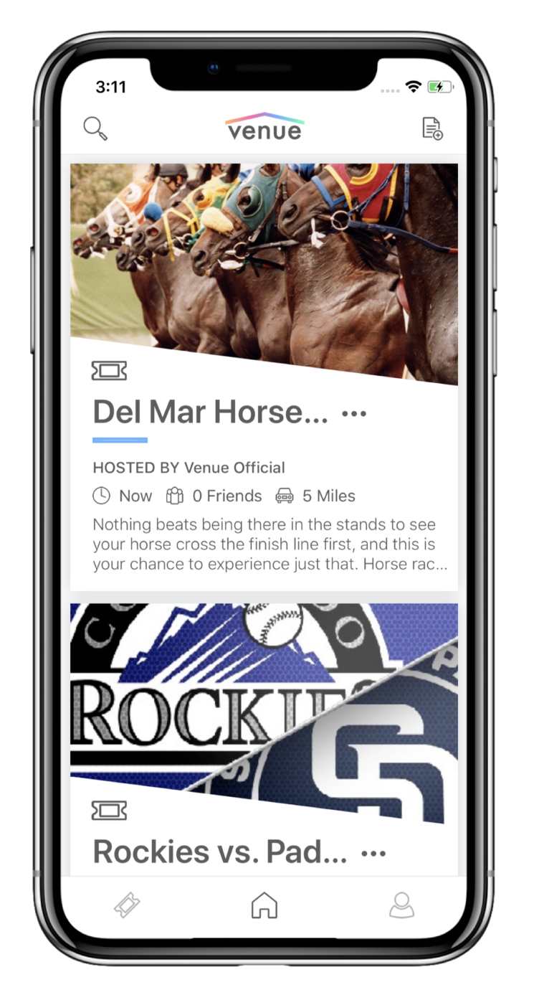
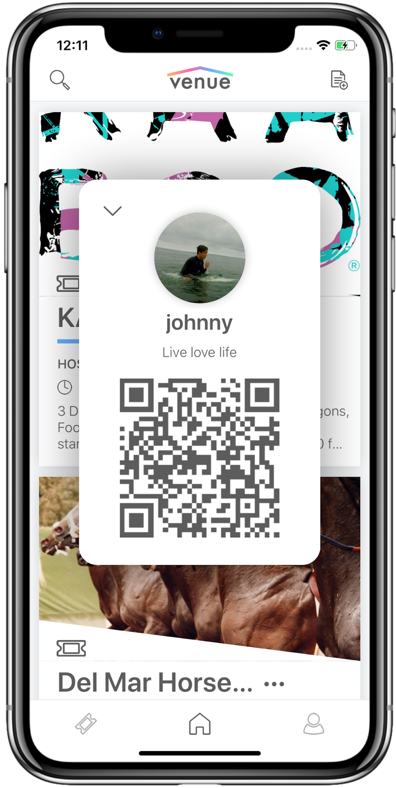

<section>

### The Goal

To create a platform for people to organize get togethers and fun events as well as connect to others based on mutual
event attendance

</section>

<section>

### The Design

<article>

The application as we saw it, would have two major functions, to host your own events and manage them through the app,
and to connect with others through mutual attendance. We saw the best way to implement the attendance aspect of this as
being a system that would let you browse events freely, sorted based on a number of elements such as proximity, friend
attendance, and date.

<aside>

</aside>

</article>

<article>

<aside>

</aside>

For organizing events, we decided that a ticketing system might be helpful to allow event organizers to manage larger
RSVP lists. Thus, we thought that a QR based ticketing system would work well to simplify this process. We decided that
we should assign an individual QR identifier to each account, so users would have one ticket for every event they
attended. Additionally, we decided to allow our users to invite people to their events by text message and through the
application. We decided to tie this feature closely to the users contacts. The user would be able to look through their
contacts and add their friends, when they sent out the invites, their friends with accounts would be invited through the
app, and friends without accounts would be invited through our text message services.

</article>

</section>

<section>

### The Execution

#### FRONTEND

The frontend was made using React Native and Redux.js. All icons and images were created by myself using Adobe
Illustrator. We decided to give the application a mascot in the form of a spaceman to liven up the design a little bit.

#### BACKEND

For the backend, we decided to initially set up our project with a very light and simple database, Firebase. We also
made use of Google Firestore to send real-time notifications of invites and event updates. For search indexing, we made
use of the Algolia API and for text messaging we used Twillio.

</section>

<section>

### Takeaways

In this lengthy project, I learned a lot about human centered design and software development in general. This was my
first foray into user testing as well as my first experiment testing the limits of visual computations on mobile phones.
The project was never launched, but it is deployed [here](https://apps.apple.com/us/app/venue-find-fun/id1311072924) if you would like to play with it.

</section>
